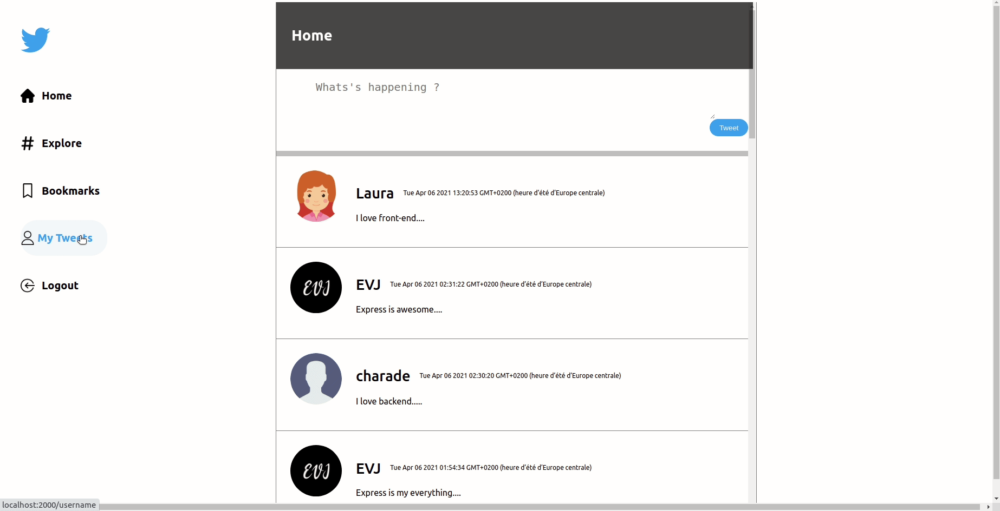

## Tweeter_Clone_NodeJs
Clone simplifié de Twitter en Node.js avec une base de données en MySQL qui stocke les données, le tout en respectant l'architecture MVC et incluant l'authentification en JWT.

### User Story

- ETQ visiteur je veux m'inscrire
- ETQ utilisateur je veux me connecter à mon compte
- ETQ utilisateur connecté je veux me déconnecter
- ETQ visiteur je veux consulter les 20 derniers tweets tous utilisateurs confondus
- ETQ visiteur je veux consulter la liste des tweets d'un utilisateur précis
- ETQ visiteur je veux consulter le détail d'un tweet
- ETQ utilisateur connecté je veux créer un tweet
- ETQ utilisateur connecté je veux modifier le texte de mon tweet
- ETQ utilisateur connecté je veux supprimer un de mes tweets

### Instructions d'installation

1. Node setup
    - Créer un nouveau dossier dans votre machine
    - Installer node depuis votre terminal

            sudo apt install nodejs

    - Ouvrir node dans le terminal et le tester

2. Initialiser un fichier package.json

            npm init

3. Installer des modules

        npm install express        
        npm install -D nodemon        
        npm install mysql2        
        npm install ejs
        npm install path        
        npm install body-parser        
        npm install cookie-parser        
        npm install jsonwebtoken         
        npm install bcrypt
        npm install express-session
        npm install express-flash-message
        npm install express fileupload
        npm install local-storage
        npm install node-localstorage

### Guide d'utilisation et sécurité
1. Login et Flash-message

2. Signup et Flash-message

3. Créer un tweet

4. Modifier ou suprimmer un tweet

5. Sécuriser le site

### Contributors
Charles EKOMIE Github: https://github.com/charade
Puthpiseth TUN Github: https://github.com/Puthpiseth 

Jerome ELIEZER VANEROT Github: https://github.com/eliezer-web

